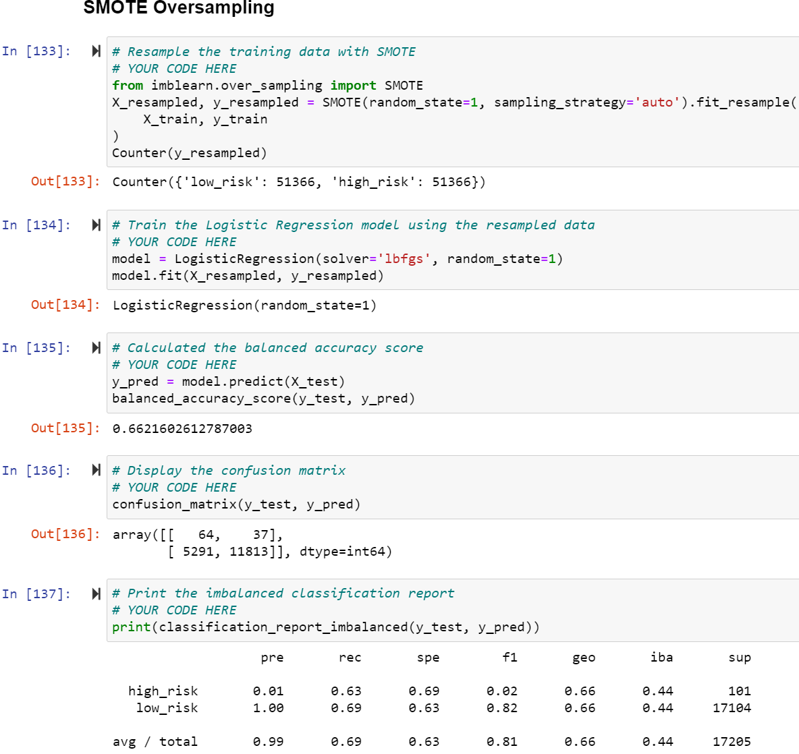
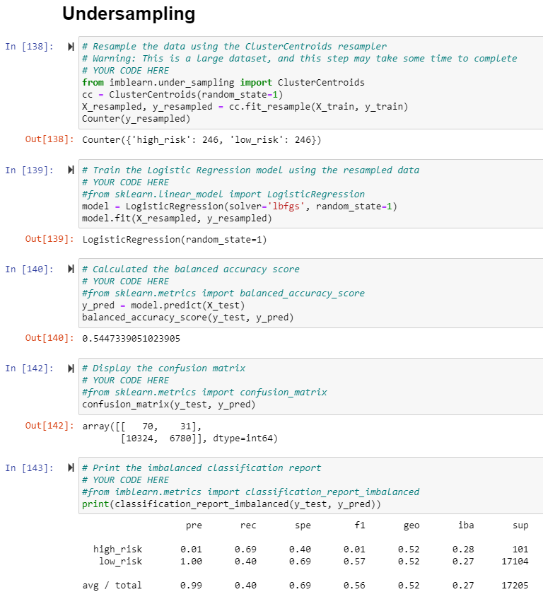
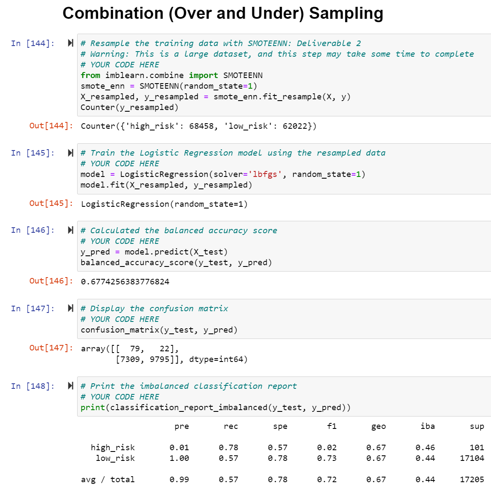
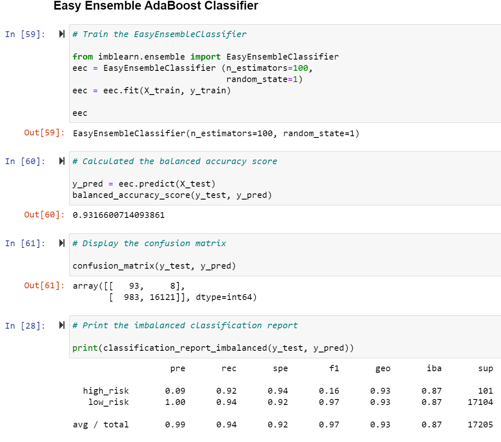

# Credit_Risk_Analysis

## Overview/Purpose:

The purpose of this challenge was to apply what we've learned about **supervised machine learning** and how it applies to credit card risk. 
According to the module, "Credit risk is an inherently unbalanced classification problem..." because good loans outweigh risky loans. 
Thus, the goal is to apply different techniques to test, train and assess models with unbalanced classes.
As such, the *imbalanced-learn* and *scikit-learn* libraries were used in the challenge for building models and resampling. 

With the credit card credit dataset (from LendingClub, a peer-to-peer lending services company) the following approaches were taken:

1. **Oversample** the data using:  >>*smaller class resampled to be larger*   
      - RandomOverSampler (Naive Random Oversampling)
      - synthetic minority oversampling technique (SMOTE) algorithms  
2. **Undersample** the data using:  >>*the size of the majority class is decreased* 
      - ClusterCentroids algorithm  
3. **Combination approach** of "Over- & Under-" sampling the data using:
      - SMOTEENN algorithm (combines SMOTE and Edited Nearest Neighbors (ENN) algorithms)  

In addition, two new machine learning models (meant to reduce bias) were also included in the assessment to predict credit card risk: 

4. **BalancedRandomForestClassifier** 
5. **EasyEnsembleClassifier** 

## Results:

The following results show the accuarcy score, the confusion matrix and the classification report for each model tested: 

 
The balanced accuracy of this model's algorithm is around 65%. 
High risk application results show a 1% precision score and a 69% recall score. 
Low risk application results show a 100% precision score and a 61% recall score. 
The Average/Total application results show a 99% precision score and a 61% recall score. 
 
      
 
The balanced accuracy of this model's algorithm is around 66%, which is a little better than the previous model. 
High risk application results show a 1% precision score and a 63% recall score. 
Low risk application results show a 100% precision score and a 69% recall score. 
The Average/Total application results show a 99% precision score and a 69% recall score. 
   
      
 
The balanced accuracy of this model's algorithm is around 54%, which is far lower than the two previous models. 
High risk application results show a 1% precision score and a 69% recall score. 
Low risk application results show a 100% precision score and a 40% recall score. 
The Average/Total application results show a 99% precision score and a 40% recall score. 
 
      
 
The balanced accuracy of this model's algorithm is around 68%. 
High risk application results show a 1% precision score and a 78% recall score. 
Low risk application results show a 100% precision score and a 57% recall score. 
The Average/Total application results show a 99% precision score and a 57% recall score. 
 
      
 
The balanced accuracy of this model's algorithm is around 79%. 
High risk application results show a 3% precision score and a 70% recall score. 
Low risk application results show a 100% precision score and a 87% recall score. 
The Average/Total application results show a 99% precision score and a 87% recall score. 
 
   
 
The balanced accuracy of this model's algorithm is around 93%, the highest across all models. 
High risk application results show a 9% precision score and a 92% recall score. 
Low risk application results show a 100% precision score and a 94% recall score. 
The Average/Total application results show a 99% precision score and a 94% recall score. 
 

## Summary:

Summary of results
Recommendation
