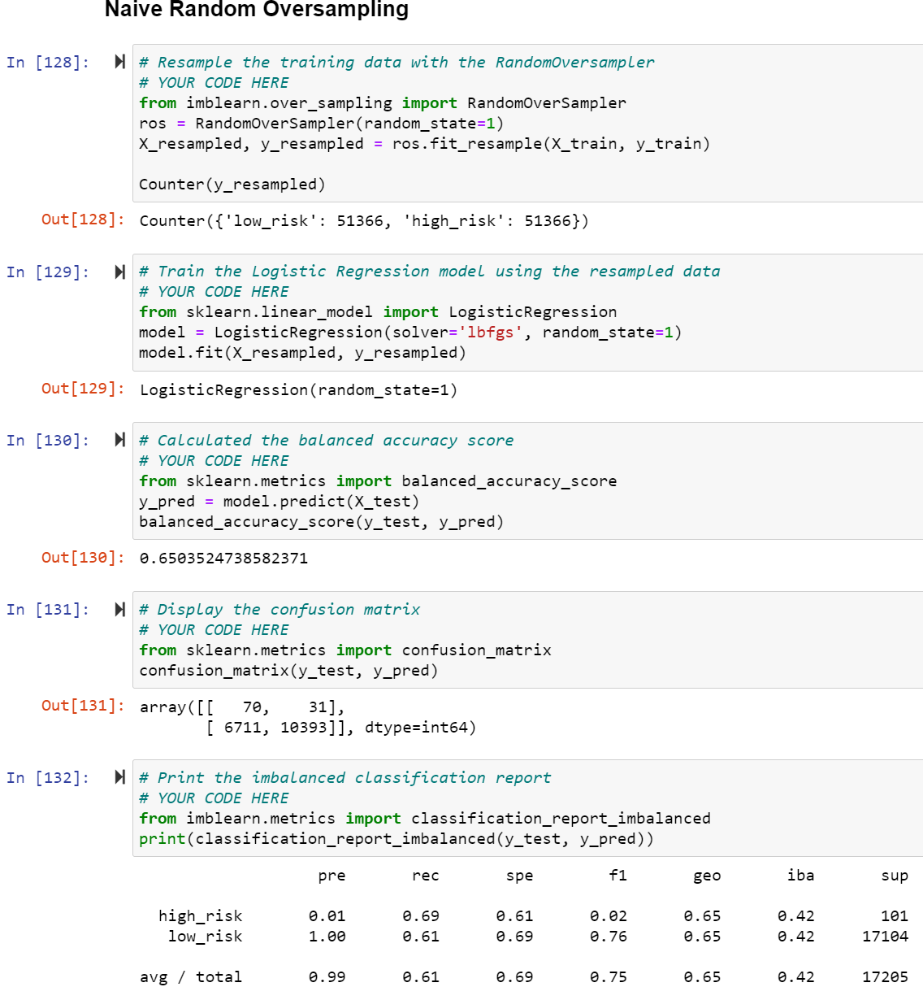
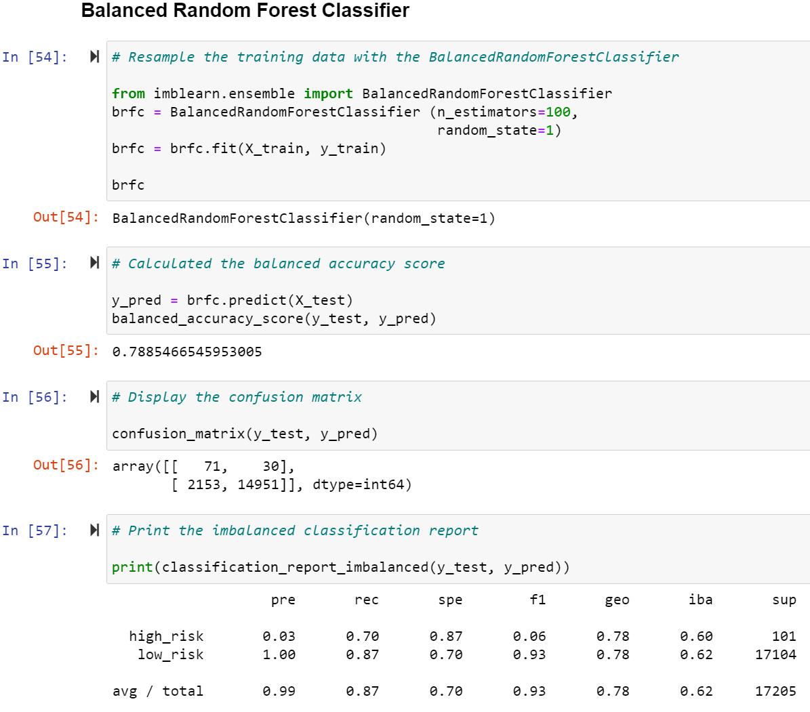

# Credit_Risk_Analysis

## Overview/Purpose:

The purpose of this challenge was to apply what we've learned about **supervised machine learning** and how it applies to credit card risk. 
According to the module, "Credit risk is an inherently unbalanced classification problem..." because good loans outweigh risky loans. 
Thus, the goal is to apply different techniques to test, train and assess models with unbalanced classes.
As such, the *imbalanced-learn* and *scikit-learn* libraries were used in the challenge for building models and resampling. 

With the credit card credit dataset (from LendingClub, a peer-to-peer lending services company) the following approaches were taken:

1. **Oversample** the data using:  >>*smaller class resampled to be larger*   
      - RandomOverSampler (Naive Random Oversampling)
      - synthetic minority oversampling technique (SMOTE) algorithms  
2. **Undersample** the data using:  >>*the size of the majority class is decreased* 
      - ClusterCentroids algorithm  
3. **Combination approach** of "Over- & Under-" sampling the data using:
      - SMOTEENN algorithm (combines SMOTE and Edited Nearest Neighbors (ENN) algorithms)  

In addition, two new machine learning models (meant to reduce bias) were also included in the assessment to predict credit card risk: 

4. **BalancedRandomForestClassifier** 
5. **EasyEnsembleClassifier** 

## Results:

The following results show the accuarcy score, the confusion matrix and the classification report for each model tested: 

 
The balanced accuracy of this model's algorithm is around 65%. 
High risk application results show a 1% precision score and a 69% recall score. 
Low risk application results show a 100% precision score and a 61% recall score. 
The Average/Total application results show a 99% precision score and a 61% recall score. 
 
      
 
The balanced accuracy of this model's algorithm is around 66%, which is a little better than the previous model. 
High risk application results show a 1% precision score and a 63% recall score. 
Low risk application results show a 100% precision score and a 69% recall score. 
The Average/Total application results show a 99% precision score and a 69% recall score. 
   
      
 
The balanced accuracy of this model's algorithm is around 54%, which is far lower than the two previous models. 
High risk application results show a 1% precision score and a 69% recall score. 
Low risk application results show a 100% precision score and a 40% recall score. 
The Average/Total application results show a 99% precision score and a 40% recall score. 
 
      
 
The balanced accuracy of this model's algorithm is around 68%. 
High risk application results show a 1% precision score and a 78% recall score. 
Low risk application results show a 100% precision score and a 57% recall score. 
The Average/Total application results show a 99% precision score and a 57% recall score. 
 
      
 
The balanced accuracy of this model's algorithm is around 79%. 
High risk application results show a 3% precision score and a 70% recall score. 
Low risk application results show a 100% precision score and a 87% recall score. 
The Average/Total application results show a 99% precision score and a 87% recall score. 
 
   
 
The balanced accuracy of this model's algorithm is around 93%, the highest across all models. 
High risk application results show a 9% precision score and a 92% recall score. 
Low risk application results show a 100% precision score and a 94% recall score. 
The Average/Total application results show a 99% precision score and a 94% recall score. 
 

## Summary:

Based on accuracy scores alone and looking at the different resampling algorithms, all four models were poor performers of predicting credit risk. Whether we were oversampling, undersampling or a combination of the two, the balanced accuracy scores ranged between 54% and 68%.  Using a combination model yielded the highest score. However, when we assessed two additional models that reduces bias, we see an increase in the accuracy score. While the Balanced Random Forest Classifier (BRFC) improved to 79%, the Easy Ensemble AdaBoost Classifier (EE) machine learning model significantly increased to 93%. Hence, we can say here that across all the models, the EE has the highest accuracy. Prematurely, an accuracy score alone may not be as meaningful without looking at precision and recall/sensitivity.

Precision, or Positive Predictive Value (PPV), is an indicator of whether the model correctly predicted the results to be true. Here, a true positive would mean we correctly predicted a high risk application. Using the confusion matrix, we can see the number of high risk applications that were correctly identified and the amounts identified are dramatically low. Across the precision score of the models for high-risk applications, they all come in at 1% with the exception of the additional models. However, the BRFC and EE model still have low precision scores of 3% and 9% respectively. Again, the EE model seems to have the highest percentage across the models, but it's still low enough that it's difficult to determine model effectiveness.

This then drives us towards the recall/sensitivty results. In this case, it means the measure of how many applications are actually high risk. Based on sensitivity, we see a higher precentage across all the models, which means that of all the high risk applicants in the dataset, this number shows how many were correctly identified. Across the different models, EE seems to be generating the highest percentage with a score of 92%. The other models range between 63%-78%. Thus, it's safe to say that the EE model was able to identify the highest percentage of high-risk applicants.

In conclusion, if I had to choose a model between these 6 methods, I would choose the Easy Ensemble AdaBoost Classifier as it generates the highest percentage of accuracy and sensitivity. However, as a credit-lender, I would err on the side of caution because if I'm making a determination based on sensitivity, it's important to keep in mind that I would be approving high-risk applications thinking they are low-risk applicants. Granted for this EE model, it's roughly 8% - but that's a risk that should be further explored and possibly even looking at financial impact or further research before making a final determination.  
